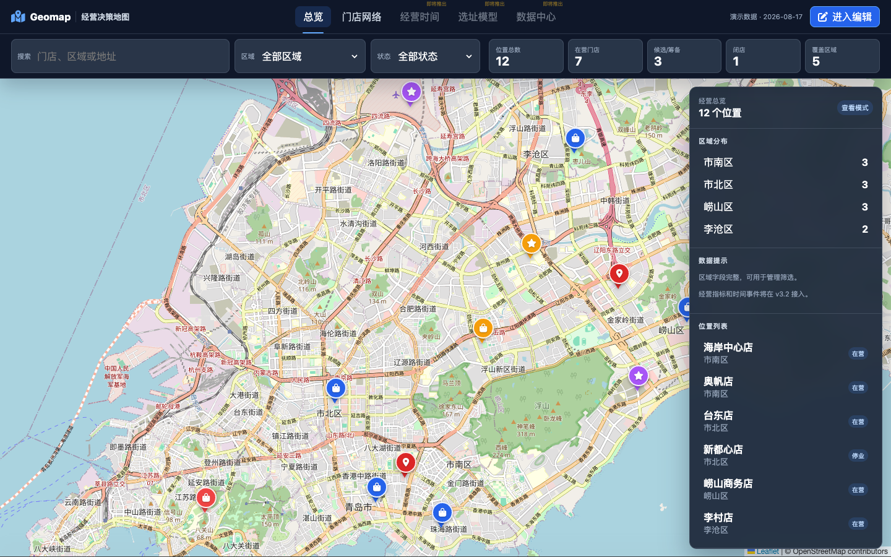

# GeoJSON Map Editor · GeoJSON 地图编辑器

<div align="center">

[](CHANGELOG.md)
[](https://github.com/Superhedgehoger/Geomap-app/actions/workflows/ci.yml)
[](LICENSE)

**[在线体验](https://superhedgehoger.github.io/Geomap-app/) · [Lite 版](https://superhedgehoger.github.io/Geomap-app/?variant=lite) · [更新日志](CHANGELOG.md)**

基于 Leaflet 的隐私友好型 GeoJSON 编辑工作台：绘制、分组、快照、表格、统计和离线分发集中在一个浏览器应用中。

Privacy-friendly, browser-based GeoJSON workspace for drawing, grouping, snapshots, tables, analytics, and portable distribution.

</div>



> 截图仅使用仓库内的 [`example.geojson`](example.geojson)，不包含真实业务数据。

## 能做什么 · Highlights

| 能力       | 说明                                                        |
| ---------- | ----------------------------------------------------------- |
| 地图编辑   | 标记、折线、多边形、矩形、圆形和样式编辑                    |
| 数据管理   | GeoJSON、Excel、CSV 导入导出，地图/图层/表格四向联动        |
| 组织与回溯 | 自定义分组、点聚合、历史快照和只读浏览模式                  |
| 数据洞察   | 虚拟化表格、实时统计看板、可配置标记弹窗                    |
| 安全与隐私 | 数据保留在浏览器中，不上传；导入数据按不可信内容处理        |
| 分发       | GitHub Pages、Full/Lite 共用源码、可生成真正自包含的单 HTML |

## 立即使用 · Quick start

```bash
git clone https://github.com/Superhedgehoger/Geomap-app.git
cd Geomap-app
npm ci
npm run dev
```

Windows 用户也可以双击 `启动地图编辑器.bat`。它会进入项目目录、检查 Node.js/npm、首次安装或修复依赖、生成本地 vendor 资源并自动打开 Vite 服务。

打开终端输出的本地地址。生产构建使用：

```bash
npm run build:pages
npm run build:standalone:all
npm run build:release
```

输出位置：Pages 资源在 `dist/`，离线 Full/Lite 单文件在 `release/`；`build:release` 还会把两个离线模板复制到 `dist/downloads/`，供网页内“导出为单网页版”使用。

## Full 与 Lite

| 功能                         | Full |       Lite       |
| ---------------------------- | :--: | :--------------: |
| 绘制、分组、表格、快照、看板 |  ✅  |        ✅        |
| 事件追踪器及事件字段         |  ✅  |        ❌        |
| 访问方式                     | `/`  | `/?variant=lite` |

Lite 是公开能力配置，不维护第二套业务源码；事件数据在 Lite 的导入、显示和导出边界都会被移除。

## 离线说明 · Offline behavior

单文件包含应用脚本、样式、字体和第三方库。完全断网时会切换为坐标网格底图，地图要素编辑、快照、表格和导入导出仍可使用；全球在线瓦片不会被打包进 HTML，联网后会自动恢复。

The standalone file embeds all application assets. With no network it uses a coordinate-grid background while editing and data tools remain available; global map tiles resume when connectivity returns.

## 工程结构

- `src/`：v3 TypeScript 核心，包括配置、类型、FeatureStore、数据边界、安全与存储迁移。
- 根目录旧版脚本：渐进迁移期间的兼容层，仍承载现有完整 Leaflet UI。
- `scripts/`：固定版本 vendor 资源、离线单文件和 README 截图生成。
- `tests/`：Vitest 单元测试、Python 兼容测试和 Playwright 浏览器回归。

开发质量命令：

```bash
npm run check
npm run test:e2e
npm run capture:readme
```

详细设计与迁移约束见 [`updatedocs/ARCHITECTURE_V3.md`](updatedocs/ARCHITECTURE_V3.md) 和 [`updatedocs/DEVELOPER_GUIDE.md`](updatedocs/DEVELOPER_GUIDE.md)。

## 浏览器与设备

- Chrome、Edge、Firefox 当前主流版本，Safari 17+
- ≥1024px：完整编辑体验
- 768–1023px：平板核心编辑与底部表格
- <768px：地图浏览及导入导出；完整绘图请使用更大屏幕

## License

[MIT](LICENSE) © 2026 Superhedgehoger
